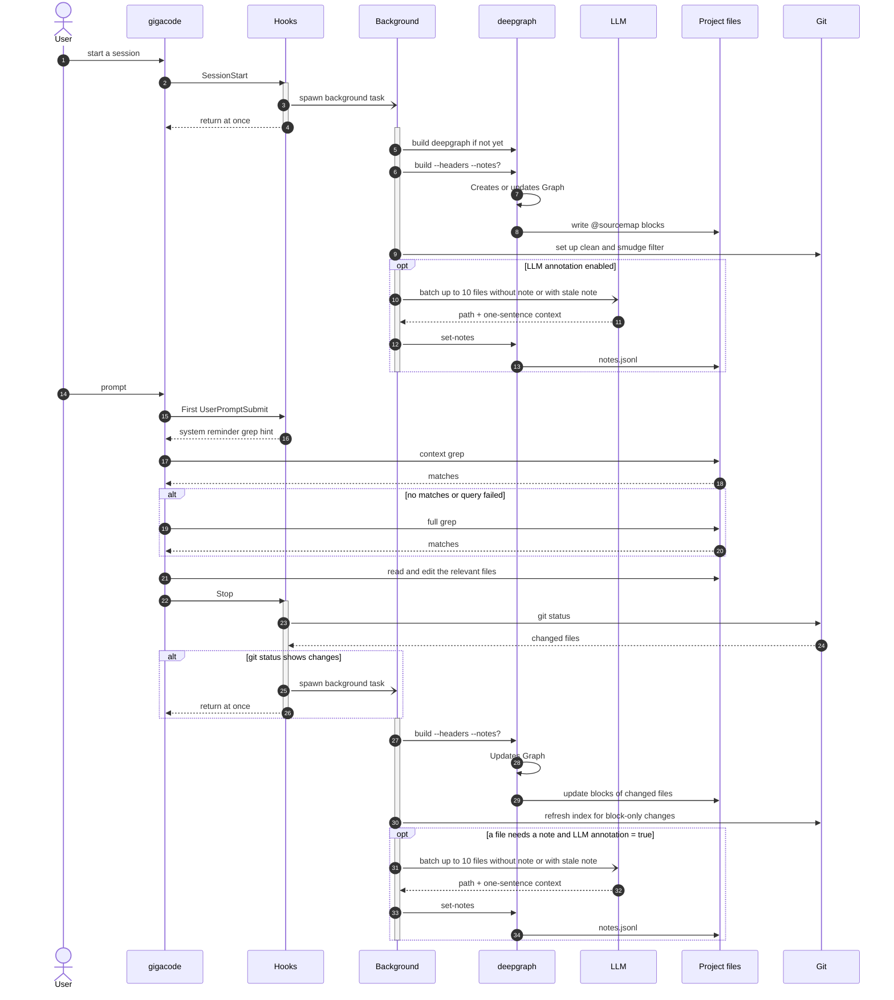

# sourcemap
A qwen-code extension that appends a small comment block to the end of each project file: what the file does, what it exports, and which files depend on it.
```ts
/* @sourcemap (generated; do not edit)
 * @ctx: Enqueue and close events for snackbar notifications. Exports: CloseSnackbarEvent, EnqueueSnackbarEvent
 * @dependents: businesses/src/utils/Notification.dispatcher.ts
 * @end-sourcemap */
```
The agent doesn't need a new tool or a subagent to use it. Its own grep finds files by what they do: `@ctx:.*aircraft` returns one description line per file, instead of every line of code mentioning aircraft, and whenever it reads a file, it sees what a change could break.
So it spends its budget on the task rather than on finding related files, and it doesn't forget to check the files that depend on the one it changes.

The blocks never reach git: a local git clean filter strips them whenever git reads a file, so `git status`, `git diff` and commits don't see them, and teammates are unaffected.
The notes (`ctx`) are written by the LLM in the background and committed in `.qwen/sourcemap/notes.jsonl`, so a team pays for each note once.

Dependencies come from static analysis rather than LLM judgment, which is why the extension requires Rust. It ships a vendored [deepgraph](deepgraph/README.md), built in the background on the first session start after install.

## How it works
- **Session start**, in the background:
  1. builds deepgraph if needed;
  2. sets up the git filter;
  3. scans the project and updates the blocks;
  4. annotates files without a current note.
- **End of each agent turn** (Stop hook): rescans, updates the blocks of changed files and their dependents, and annotates new or changed files in the background.
- **The first prompt of each session** gets a short hint telling the agent what the blocks are, and never to edit them.



The project is the whole git repository, even when qwen is started in one of its subdirectories, so there's one set of notes per repository.

Blocks are only written in a git work tree, once the filter is set up and verified. They're skipped entirely if another git filter (e.g. Git LFS) already applies to one of the supported file types.

## Files
| What | Where | Committed |
|---|---|---|
| Notes, plus their union-merge `.gitattributes` | `<project>/.qwen/sourcemap/` | yes (make sure `.qwen/` isn't gitignored) |
| Blocks | end of each supported file | never (stripped by the filter) |
| Filter config | `.git/info/attributes` and `.git/config` | no (local) |
| Graph, error log, locks | `~/.qwen/sourcemap/projects/<project>-<id>/` | no |
| deepgraph binary, build log | `~/.qwen/sourcemap/` | no |

## Settings
Asked at install time, and may be changed later with `qwen extensions settings set sourcemap <setting>`:
- LLM annotation: `true` (default) writes a one-sentence note per file in the background, using your qwen quota. `false`: the blocks carry dependents only.
- Exclude patterns: comma-separated gitignore-style globs to leave out. `.gitignore` and non-code directories such as `node_modules` are already skipped.
- OpenAI API logging: `true` passes `--openai-logging` to the extension's background qwen calls.

A file that can't be annotated (the model fails on it, or leaves it out of its answer) is retried in at most 2 runs, then left without a note until it changes; `error.log` says which. Set `SOURCEMAP_MAX_FAILURES` in the environment to change the limit.

## Uninstall
qwen-code has no uninstall hook, so before uninstalling the extension, run this in every project it was used in:
```sh
<extension dir>/hooks/scripts/uninstall.sh <project dir>
```
It removes the blocks and the git filter. If the filter is left configured without its binary, git refuses to add files, by design, so that a block can never be committed silently.

## Troubleshooting
Errors from every hook and background script go to `~/.qwen/sourcemap/projects/<project>-<id>/error.log`. deepgraph's build output is in `~/.qwen/sourcemap/build.log`.
